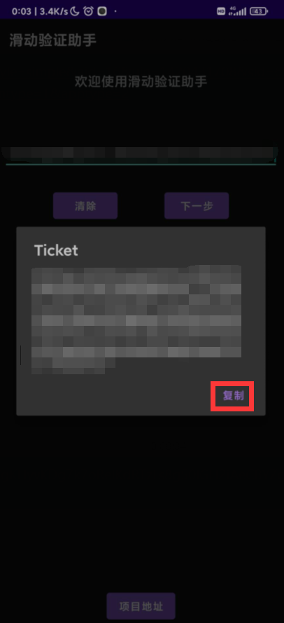
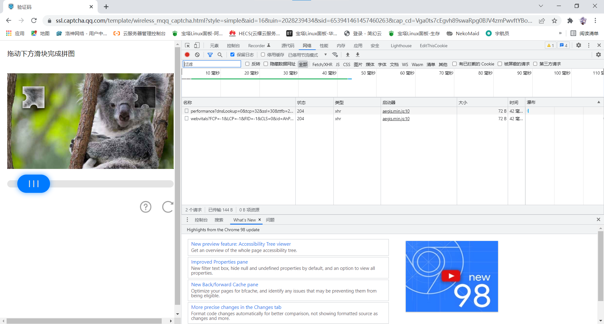
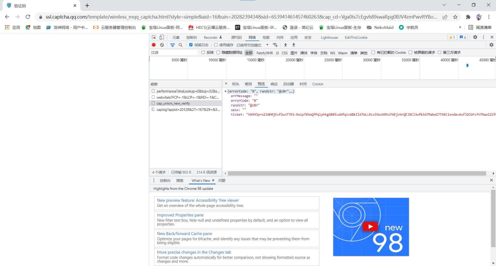
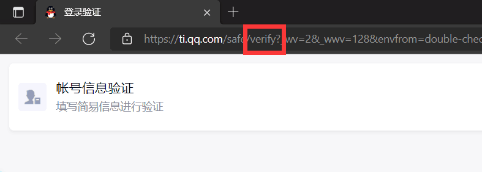
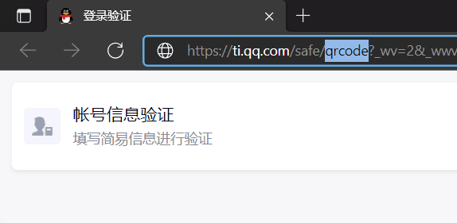
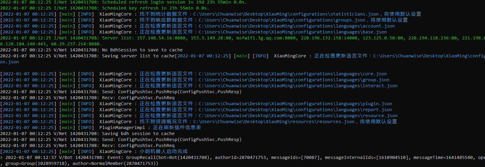
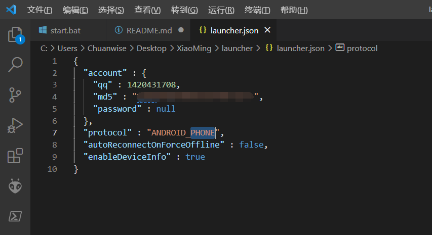
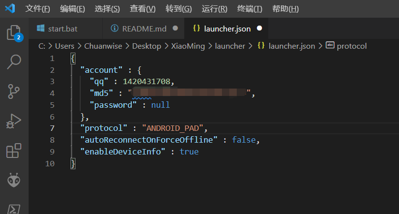

# 用户手册
欢迎来到小明机器人用户手册。这篇文章将讲解如何配置、日常管理小明。

> 本文面向小明的普通用户。如果你是开发人员，在阅读完本篇文章后，还可以阅读[开发文档](/development)

如果你遇到了问题或希望小明具有新的功能，欢迎加入**小明及相关插件的技术交流 / 用户 QQ 群**：`1028959718`。

## 配置
### 准备工作
#### 小明启动器
小明是一个机器人框架，需要使用启动器启动。我们提供一个简单易用的启动器，名为 `XiaoMingHost`，可以在 `小明练剑场` 群里下载到最新版本。

#### Java 8+
`XiaoMingHost` 是使用 `Java` 编写的，你需要具备 `Java 运行时` 才能启动该程序。请在打开设备的控制台，输入 `java -version` 查看是否有反映。如果显示的不是 `Java` 版本或版本低于 `1.8`（`Java 8`），可以到[官网](https://www.oracle.com/cn/java/)下载（看不懂可以使用谷歌机翻）。

#### 一个文件夹
小明初次启动会创建一些文件夹。请 **不要直接将启动器放在桌面等处**，最好专门将其放在一个文件夹中（下文称「小明根目录」或「小明目录」）。

### 启动小明本体
小明本体需要 `Java 8` 或更高版本的环境。如果你会开设 `Minecraft` 服务器，相信这对你而言并不是问题。

#### 下载 `XiaoMingHost`
小明本体程序名为 `XiaoMingHost`，你可以在 `小明练剑场` 群文件中下载到最新版。它有两个分支，一个是 `XiaoMingHostGraphical`（带有图形用户界面，即将发布）和 `XiaoMingHostTerminal`（纯控制台界面）。推荐使用控制台版本。

#### 准备小明根目录
准备一个新的空文件夹，作为 `小明根目录`。将你下载好的 `XiaoMingHost` 放入其内。

#### 制作启动脚本
随后创建一个文本文件，取名任意。内容如下：

```bash
java -jar xxx.jar
pause
```

其中的 `xxx` 是你下载到的 `XiaoMingHost` 文件的名字。例如 `XiaoMingHostTerminal-4.4.jar`。

##### ***务必注意***

1. `-jar XiaoMingHostTerminal-xxx.jar` 是一个整体。你可以继续添加其他的 `JVM` 参数，但是 **请注意**，这些参数应该被添加在 `java` 和 `-jar` 之间， **而不是** 添加到 `-jar` 和 `XiaoMingHostTerminal-xxx.jar` 之间。
1. `java`，`-jar` 和 `XiaoMingHostTerminal-xxx.jar` 三个部分之间至少要有一个空格。
1. **请不要** 真的原样复制启动脚本内容。请将文件名修改为你 **将要启动** 的 `XiaoMingHost` 文件的名字。例如，你下载的是 `XiaoMingHostTerminal-4.4.jar`（注意版本号是 `4.4`），你应该写 `java -jar XiaoMingHostTerminal-4.4.jar`。
对于 `Windows` 用户，请将扩展名修改为 `.bat` 或 `.cmd`，例如 `start.bat`。对于 `Linux` 用户，请将扩展名修改为 `.sh`，例如 `start.sh`。这就是小明本体的启动脚本了。

**结尾建议添加一个 `pause` 暂停，方便查看控制台输出。**


如上图，我在桌面创建了 `XiaoMing` 文件夹作为小明本体文件夹，随后下载了 `4.4` 版的 `XiaoMingHostTerminal`，并编写了启动脚本。

#### 初次启动小明
##### 此前未使用过Mirai核心的机器人
对于 `Windows` 用户，请双击启动脚本。对于 `Linux` 用户，请在 `小明根目录` 下执行 `sh start.sh` 或 `./start.sh` 启动小明（可能会出现权限不足的问题，请执行 `chmod 755 start.sh`）。

初次启动小明时，你需要输入 `QQ` 和密码。**请仔细阅读屏幕输出**，特别在输入密码时，小明不会显示你输入的密码，**这是一种保护机制，看起来就像是无法输入那样。正常输入密码后回车即可**。

初次启动时 ***极有可能** 需要进行滑块验证。**请不要随便关闭弹框。**

首先，你可能遇到形如下面的滑动验证码弹窗。


+ 使用滑块验证助手
> 
> 如果你使用安卓手机，请在手机上下载 `滑块验证助手`（你可以在 `小明练剑场` 群文件找到，位于 `滑块验证和登陆设备信息采集器` 文件夹下的 `app-release.apk`），将上图中红框中的文本发送到手机上，打开滑块验证助手，将其粘贴到验证码地址输入栏里，随后点击 `下一步`，完成滑块验证后，你将得到一个 `Ticket`：
> 
> 
> 
> 点击复制以复制该 `Ticket`，将其发送回电脑，并粘贴到弹窗偏下方的输入框中（上上图中蓝色框出），随后 **关闭** 该弹窗。

+ 使用浏览器抓包 
> 
> 首先你需要复制上上图中红色框中的 `URL`，然后打开浏览器（建议使用 `Chrome` 或 `Microsoft Edge`），在最上方的搜索框中输入该 `URL`，进入滑块验证网页，然后按下 `F12`，打开 *开发者工具*。
> 
> 
> 
> 接下来在*开发者工具* 的导航栏里找到 `Network` 或 `网络`，点击后你将会看到上图所示的一个表格（表格内容可能与图示有出入，不用理会），然后再左侧界面中完成滑块验证，你将得到下图界面。**切记**，完成后暂时不要进行任何操作！
> 
> 
> 
> 现在回到*开发者工具* 界面。在导航栏下方，有一个输入框 `Filter` 或 `过滤`，在其中输入 `cap_union_new_verify` 后按下回车键，下方表格内的 `Name` 或 `名称` 一列中将会出现与 `cap_union_new_verify` 匹配的项目，选择最下方的一个，点击它，然后在右侧选择 `Perview` 或 `预览`，点击小三角直至你能够看见一些*键值对*，该 `ticket` 所对应的***双引号内的值*** 即为通过滑块验证所需的 `ticket`。复制该值（`记住不要复制首尾的双引号`），并将其粘贴在弹窗偏下方的输入框中（其位置可参考 *使用滑块验证助手* 最后一步），按下回车即可。

`Linux` 用户可能出现无法通过滑块验证的情况，请使用 `Windows` 设备通过滑块验证后将 `Windows` 设备上的 `小明根目录/launcher/device.json` 替换掉 `Linux` 设备上的同名文件。

接下来你还可能遇到型如下图的扫码验证弹窗。


请点击**蓝色文字**打开扫码验证网页。这个网页极有可能无法加载，就算加载了填写账号信息也是很难过去的，因此我们使用扫码验证。

找到网址中的 `verify`，如下图所示：



将它改为 `qrcode`，如下图所示：



随后确定，就可以打开扫码验证界面。使用登陆了机器人的手机 `QQ` 扫码，通过验证后关闭刚才的扫码验证弹窗即可。

如果继续遇到弹窗，很可能是刚才某一步没有验证成功。弹窗无非两种，扫码验证和滑块验证，按照上面的方法再试即可。

如果一切顺利，你将通过登录安全验证，并启动小明，如下图所示。



当你看到形如 `小明机器人启动完成` 的语句时，恭喜你，你成功启动了 `XiaoMingHost`！后续你可以直接启动，不需要再次进行初次启动的安全验证了。

后续再使用 `Mirai` 核心的 `QQ` 机器人登录该机器人 `QQ` 号时，你可以直接使用小明产生的设备信息，它位于 `小明根目录/launcher/device.json` 下。

##### 此前使用过Mirai核心的机器人
如果你此前使用过 `Mirai` 核心的 `QQ` 机器人插件，可以在小明根目录下创建 `launcher` 并将此前机器人的设备信息 `device.json` 复制到该文件夹下。这样可以避免进行初次登陆的安全验证。

对于 `Windows` 用户，请 **双击** 启动脚本。对于 `Linux` 用户，请在 `小明根目录` 下执行 `sh start.sh` 或 `./start.sh` 启动小明（可能会出现权限不足的问题，请执行 `chmod 755 start.sh`）。你很有可能不再遇到安全验证，可以直接进行下一步操作。如果你遇到了安全验证之类操作，请按照 [此前未使用过Mirai核心的机器人](#此前未使用过Mirai核心的机器人) 的步骤操作。

### 完成基础配置
#### 给自己最高权限
在小明的后台（以后称为 `小明控制台`）输入 `op [你的QQ]`，例如 `op 1437100907`，将自己任命为管理员。

后续你就可以在机器人所在的群聊，或与之的私聊中发送（这样的行为称为 `执行小明指令`）指令了，**无需在控制台执行。**

如果输入时后台有输出信息，则需要重新输入一次，确保指令在完整的一行上，如下图所示。


#### 关闭小明的方式
如果需要关闭小明控制台，**最好** 在后台输入 `stop`，**而不是直接关闭（这可能造成一些数据丢失）**。

#### 修改登录协议（可选）
默认情况下，机器人是以安卓手机 `QQ` 用户身份登录的。如果你再使用安卓手机 `QQ` 登录机器人的账号，它将被挤下线。

你可以在关闭小明控制台后 `小明根目录/launcher/launcher.json` 中找到 `protocol`，它的值默认是 `ANDROID_PHONE`，如下图所示：



你可以将它修改为 `ANDROID_PAD`（安卓平板协议），如下图所示：



请务必注意，**不要删除** 周围的英文半角双引号 `"`。

`protocol` 控制登录小明的协议，所有取值如下：

|`protocol`|协议|说明|
|:----:|:----:|----|
|`ANDROID_PHONE`|安卓手机|默认登录方式，具有戳一戳等完整的功能|
|`ANDROID_PAD`|安卓平板|无法发送/接收戳一戳消息|
|`ANDROID_WATCH`|安卓手表|无法发送/接收戳一戳消息|


### 安装一些插件
小明本体只有一些非常基础的功能，例如开关小明、权限配置、调用限制等。通过安装插件，可以赋予小明更丰富的功能。

你可以在[插件中心](http://chuanwise.cn:10074/#/plugin/)找到你感兴趣的插件。找到插件本体（某个 `jar` 文件）后，将其放入 `小明根目录/plugins` 中，重启小明机器人即可。

## 相关概念
### 控制台小明用户
控制台是。在此处可以输入指令。该指令是以「**控制台小明用户**」的身份执行的，这个用户拥有至高无上的权限，所以最开始机器人所有者需要通过控制台给自己的 `QQ` 号授权。

## 文件夹
小明运行会产生大量数据，需要保存的部分会被组织在下列文件夹中。

### 插件文件夹：plugins
该文件夹内会存在若干 `jar` 文件，称为「**插件本体**」。与插件同名的文件夹，是该插件的「**数据文件夹**」或「**插件文件夹**」。插件文件夹内会有什么内容，取决于对应的插件。

### 配置信息：configurations
#### 小明基础设置：configurations.json
主要是有关调用限制、明确调用前缀、自动保存和优化周期等非常基础的设置（注：该配置已过时）。

|设置项|类型|含义|说明|
|:---:|:---:|---|---|
|`debug`|`boolean`|是否开启调试模式|默认关闭|
|`groupCallConfig`|对象|群聊小明调用限制||
|`privateCallConfig`|对象|私聊小明调用限制||
|`maxIterateTime`|`int`|替换消息值的最大次数|将在下文介绍|
|`enableLicense`|`boolean`|是否启动小明使用协议|默认关闭。如果开启，用户首次使用小明时小明会询问是否同意一个协议（内容自定），只有同意了的用户才能和机器人交互。
|`enableClearCall`|`boolean`|是否启动明确调用。明确调用就是规定小明需要响应的信息的开头，小明未来只会响应这些字符串开头的信息|
|`callPrefixs`|集合|只有`enableClearCall`为`true`时才生效|
|`maxUserInputTimeout`|`long`|在等待用户的下一次输入时，默认最长等待多久就放弃|
|`optimizePeriod`|`long`|自动优化自身性能的周期
|`savePeriod`|`long`|自动保存需要保存的文件的周期

## 消息和变量系统
自 `3.x` 以来，小明的变量系统有了非常大的升级（引入操作符、变量环境和类型系统）。

变量名是由 `.` 分割的一串字符。变量名用 `{}` 包围。例如 `{number.+10}`、`{bot.statistician.callNumber}`。其中，第一个 `.` 之前为全局变量名或上下文 `context`。这取决于变量使用的环境。由此可知 `{bot}` 和 `{number}` 是全局变量。

> 全局变量如下

|变量名|类型|说明|
|:---:|:---:|:---:|
|`bot`|`XiaoMingBot`|小明机器人实体|
|`runtime`|`Runtime`|`Java` 运行时|
|`lang`|`LanguageManager`|小明语言库|
|`number`|`int`|值为 `0`|
|`random`|`Random`|随机数生成器|

全局变量 `{number}` 是 `int` 型变量，值为 `0`。
> 对数字的运算有以下几种

|操作符|结果|结果类型|示例|
|:---:|---|:---:|---|
|`<+-*/%><number>`|该数字和 `number` 相加的结果|同 `number` |`{number.+10}` => `10`<br>`{number.+10.*20}` => `200`<br>`{number.*20}` => `0`|
|`int`|数字转化为 `int` 类型|`int`|`{number.+10.int}` => `10`|
|`double`|数字转化为 `double` 类型|`double`|`{number.+10.double}` => `10.0`|
|`delay`|将数字按时间戳转化为等待时间长度，相当于 `当前时间戳` - `当前数字` 按照毫秒数转化为时间长度|`String`||
|`after`|将数字加时间戳转化为日期，相当于 `当前时间戳` + `当前数字` 转化为日期|`String`|现在是 `2021年8月11日 09点44分`，则 `{number.+60000.after}` => `2021-08-11 09:45:16`|
|`date`|将数字按时间戳转化为日期|`Date`|`{number.+1628645956.date}` => `2021-08-11 09:39:16`|
|`account`|将数字按 QQ 号转化为用户账号|`Account`|`{number.+1437100907.account}` => `椽子（1437100907）`|
|`length`|将数字按毫秒数转化为时间长度|`String`|`{number.+1000.delay}` => `1秒`|
|`abs`|取绝对值|原本数据的类型|`{number.-100.abs}` => `100`|

> 对随机数的运算如下表

|操作符|结果|结果类型|示例|
|:---:|---|:---:|---|
|`double`|生成一个 `0` 到 `1` 之间的 `double` 类型随机数|`double`|`{random.double.abs.*100}` => 一个介于 `[0, 100)` 的随机小数|
|`int`|生成一个 `0` 到 `Integer.MAX_VALUE` 之间的 `int` 类型随机数|`int`|`{random.int.abs.%10}` => 一个介于 `[0, 10)` 的随机整数|

小明有一个指令 `echo  {消息}`，作用是让小明复读 `{消息}` 的内容，可用于测试变量。例如执行小明指令 `echo  今日人品：{random.double.abs.*100}%`。

未完待续

> **声明**
> 
> 到此你已经阅读结束小明的用户手册，赶快安装几个插件体验一下小明的功能吧！
> **小明及相关插件的技术交流 / 用户 QQ 群**：`1028959718`
>
> 查看[插件中心](http://chuanwise.cn:10074/#/plugin/)<br>
> 返回[项目首页](https://github.com/XiaoMingProject/XiaoMingBot/)<br>
> 
> |本文作者|最后更新时间|说明|
> |:---:|:---:|---|
> |`Chuanwise`|`2021年6月18日`|创建该文档|
> |`Chuanwise`|`2021年7月2日`|完善了初次启动小明相关的文段|
> |`ThymeChen`|`2022年2月22日`|完善了抓包教程、修改了部分措辞|
